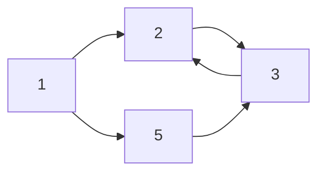

## MarkDown (md) 
: 텍스트에 양식을 입히는 마크업 언어의 일종, HTML과 연동이 가능하다. (정의)

- 다양한 협업 툴에서 활용 (Notion, Slack...)
- 다양한 Markdown용 Editor (Typora...)


## 목차 만들기 
- (table of contents)
- `[toc] + enter`


## 크기 지정
- \# 을 활용하여 크기를 설정하면 됩니다.

# 이건 h1(header 1)입니다.

## 이건 h2입니다.

### 이건 h3입니다.

#### 이건 h4입니다.

##### h5입니다.

###### h6입니다.

#### tip! 
\#를 5개 이상 쓴다는 것? -> 잘못된 분류!!


## 글꼴

- *만약 기울임체(이탤릭체)를 쓰고 싶다면 `*`로 감싸줍니다.* (또는 _로 감싸줘도 됩니다.)
_italic_

- **굵게(보드체)은 `**` 로 감싸줍니다.**
**bold**

- 취소선은 `~~` 로 감싸줍니다.
~~hello~~
- \*\*와 \_를 동시에 감싸줘도 됩니다.
**_italic+bold_**

*그래서* **한번에 쓰고 싶으면**  `ctrl + i`(i는 italic의 약자) / `ctrl + b`(b는 bold의 약자)

- 밑줄을 그어주려면 <u></u>로 글을 감싸줍니다.
<u>우리를 움직이게 하는 건 동기</u>
`<u>우리를 움직이게 하는 건 동기</u>`

## 줄바꿈
텍스트 뒤에 `space bar`를 두번 치고 enter를 누른 뒤 다음 텍스트를 씁니다.

## 띄어쓰기(enter)
- 텍스트 뒤에 `<br>` 을 치시면 됩니다. 
- `<br/>` 로 치시면 한칸 더 띄어집니다.


## 글자 색깔
- style에 색깔만 바꿔주세요.

<center><span style="color:red">빨간 글씨</span></center>
<center><span style="color:blue">파란 글씨</span></center>
<center><span style="color:green">초록 글씨</span></center>
<center><span style="color:yellow">노란 글씨</span></center>
<center><span style="color:purple">보라 글씨</span></center>

```html
<center><span style="color:red">빨간 글씨</span></center>
<center><span style="color:blue">파란 글씨</span></center>
<center><span style="color:green">초록 글씨</span></center>
<center><span style="color:yellow">노란 글씨</span></center>
<center><span style="color:purple">보라 글씨</span></center>
```

## 인용문 : 만약 인용구를 넣고 싶다면?
> `>` + space를 누르면 인용구를 만들 수 있습니다.

> 안녕하세요

> 안녕하세요
>> 안녕하세요
>>> 안녕하세요
>>>> 안녕하세요

더 넣고 싶을 땐 추가로 `>`를 넣습니다.

## 문자 박스(notice)

|Notice Type|	Class|
|---|---|
|Default|	.notice|
|Primary|	.notice-\-primary|
|Info|	.notice-\-info|
|Warning|	.notice-\-warning|
|Success|	.notice-\-success|
|Danger|	.notice-\-danger|

- `{: .notice}`으로 적용 (문장 다음 엔터치고)

**이것은 문자박스입니다.**<br>공지사항입니다. 공부를 해봅시다
{: .notice}

**이것은 문자박스입니다.**<br>공지사항입니다. 공부를 해봅시다
{: .notice--primary}

**이것은 문자박스입니다.**<br>공지사항입니다. 공부를 해봅시다
{: .notice--info}

**이것은 문자박스입니다.**<br>공지사항입니다. 공부를 해봅시다
{: .notice--warning}

**이것은 문자박스입니다.**<br>공지사항입니다. 공부를 해봅시다
{: .notice--success}

**이것은 문자박스입니다.**<br>공지사항입니다. 공부를 해봅시다
{: .notice--danger}


## 문자 정렬

### 왼쪽 정렬 (Default)
- `{: .text-left}`

안녕하세요
{: .text-left}

### 가운데 정렬
- `{: .text-center}` : 글자 쓰고 엔터 누름

안녕하세요
{: .text-center}

- `<center>가운데</center>`
<center> 안녕하세요 </center> 

### 오른쪽 정렬
- `{: .text-right}`

안녕하세요
{: .text-right}

## 줄을 바꿀 때
띄어쓰기(스페이스)를 2번 누릅니다.


## 구분선
-(하이픈)를 3개 작성하고 엔터를 누르면 구분선이 만들어집니다.
`---`

## check box
- [ ] 체크가 안 되었다. `[ ]`
- [x] 체크가 되었다. `[x]`


## 목록

- 하이픈을 입력하고 space bar를 누르면 순서 없는 목록이 만들어 집니다.
- 그리고 엔터를 누르면 하나 더 생기고
  - 엔터를 누르고 tab 키를 누르면 하위 목록을 생성할 수도 있습니다. 
    - tab을 누르니 하나가 더 생겼죠?
  - 엔터를 누르고 계속 쓰시다가 나오고 싶다면? : **shift + tab을 눌러서 나올 수 있습니다.** 
- 만약 완전히 끝내고 싶다면? 엔터를 두번 누르면 됩니다.

1. 숫자를 누르고 .(마침표)를 찍은 다음 space bar를 누르면 만들어집니다.
2. 순서가 없는 목록과 동일하게 enter를 누르면 다음 목록이 만들어 집니다.
   1. tab 키를 눌러서 하위 목록을 생성할 수 있고
   2. 나가고 싶으면 shift + tab을 눌러서 밖으로 나올 수 있습니다.

 
## 코드 블럭

### inline 코드 블록
- `(백틱 -> 숫자 1 왼쪽)을 세 번 누르고 (언어 ex)python 치고) enter
 
```python
def my_sum(a, b):
    return a + b
```

```python
print('Hello World!')
```

- [코드 생성 사이트](https://carbon.now.sh/) 여기에 들어가셔서 코드를 따로 추출해도 됩니다. `https://carbon.now.sh/`

- `https://gist.github.com/` [gist](https://gist.github.com/)
  - 추가 방법 : 조금 더 이쁘게 하고 싶을 때 github의 gist를 들어가시면
  </img>
  창이 보일 겁니다.
    1. 제목은 제목명.언어확장자(py, ipynb, java...)로 하시면 해당 언어로 코드가 완성됩니다.
    2. 코드를 썼으면 Create secret gist를 누르시고
  </img>
    2_1. private, public 모두 상관없습니다. 공개 여부의 차이만 있을 뿐입니다.
    3. 해당 주소를 카피해서 원하는 줄에 넣으시면 코드가 이쁘게 나오는 걸 볼 수 있습니다.
  <script src="https://gist.github.com/ingu627/58d1f351b58acf3571f5089436a505e6.js"></script>


만약 특정한 문장을 코드 블럭으로 만들고 싶으면 `1 + 2 = 3` (백틱 - [숫자 1 왼쪽]으로 감싸줍니다.)
- \`(백틱)로 감싸주면 배경색을 회색으로 바꿔줍니다.
`백틱 사용하기`

### 코드 블럭 (tab 2번)
- tab을 두번 누르면 위의 백틱(`)을 사용한 것과 같습니다.

안녕하세요 활용 (보통 코드 결과에 활용)

    안녕하세요

## 표 (table)

`|(파이프)` 를 활용하여 컬럼을 만들 수 있습니다. 

파이프 기호를 만들고자 하는 컬럼으로 감싸줍니다.

`|컬럼1|컬럼2|` + enter 

`|---|` 을 입력해서 표(table) 입력임을 표시합니다. (- 수는 상관없습니다.)
(`|-|` 기호로도 입력할 수 있습니다.)

| 순번 | 이름   | 나이 |
| :--: | ------ | ---- |
|  1   | 홍길동 | 100  |
|  2   | 김길동 | 120  |
|  3   | 박길동 | 140  |
|      |        |      |
|      |        |      |
|      |        |      |
|      |        |      |

```markdown
표 정렬

--- 정렬하지 않음
:--- 왼쪽으로 정렬
---: 오른쪽으로 정렬
:---: 가운데 정렬
```

## 이미지

- 문법 : ``
예시 : ``

- 또는 html 언어를 써도 됩니다.
``


## 이미지를 md 파일에 복사하기

- 제가 가장 많이 하는 방법은 github.com 의 issue나 gist.github.com 을 이용하는 것입니다.
<br/>
해당 이미지를 `ctrl + c`를 누르시고 아래에 `ctrl + v`를 하시면


로 나옵니다. 이것을 그대로 md파일에 복사넣기 하면 이미지가 생성됩니다.


## 이미지에 링크를 걸고 싶을땐
  `[](이미지 주소 링크)`

[](https://ko.wikipedia.org/wiki/%EB%B6%81%EB%91%90%EC%B9%A0%EC%84%B1)

## 일반 링크
- `['글'](링크를 넣어주세요)`

[북두칠성에 더 알고 싶다면??](https://ko.wikipedia.org/wiki/%EB%B6%81%EB%91%90%EC%B9%A0%EC%84%B1)

또는 html로 써도 됩니다
`<a href="naver.com">링크이름</a>`

## 새창으로 링크
- `['글'](링크를 넣어주세요){: target="_blank"}`

['네이버'](https://www.naver.com){: target="_blank"}

## 새창으로 버튼 링크
- `['글'](링크를 넣어주세요){: .btn.btn-default target="_blank"}`

['네이버'](https://www.naver.com){: .btn.btn-default target="_blank"}
## 수식

- \$로 감싸면 수식이 마치 문서처럼 써집니다.
  - $a+b=c$
  - $y = 3x$
  - $a^2+b^2=c^2$
  - `$a^2 + b^2 = c^2$`
  - $3x^2_1 + 3x_2 = 10$
  - `$3x^2_1 + 3x_2 = 10$`

- \$\$ 달러 2개는 항상 중앙에 쓰도록 해줍니다.
  - $$a+b=c$$
  - `$$a+b=c$$`
   - $$(\alpha + \beta)^2 = \alpha^2 + 2\alpha\beta+\beta^2 $$
   - `$$(\alpha + \beta)^2 = \alpha^2 + 2\alpha\beta+\beta^2 $$`

- $min_a$
- $min_b$

### tip!
만약 특수문자 그대로 사용하고 싶다면 앞에 \(역슬래시)를 추가해주면 됩니다.
\$
`\$`

```markdown
$y=3x$ #수직을 $로 감싸주기
```

## 그래프로 표시하기



```markdown
graph LR
  1-->2
  1-->5
  2-->3
  3-->2
  5-->3
```
- (mermaid)

## References
- [[토크ON세미나] Git & GitHub Page 블로그 만들기 4강 - Github Page 활용하기 | T아카데미](https://www.youtube.com/watch?v=eCv_bh-Ax-Q)
- [마크다운 문법 소개](http://ccl.cckorea.org/syntax/)
- [[Github Blog] minimal mistakes - 포스팅 글 써보기](https://eona1301.github.io/github_blog/GithubBlog-Posting/)


